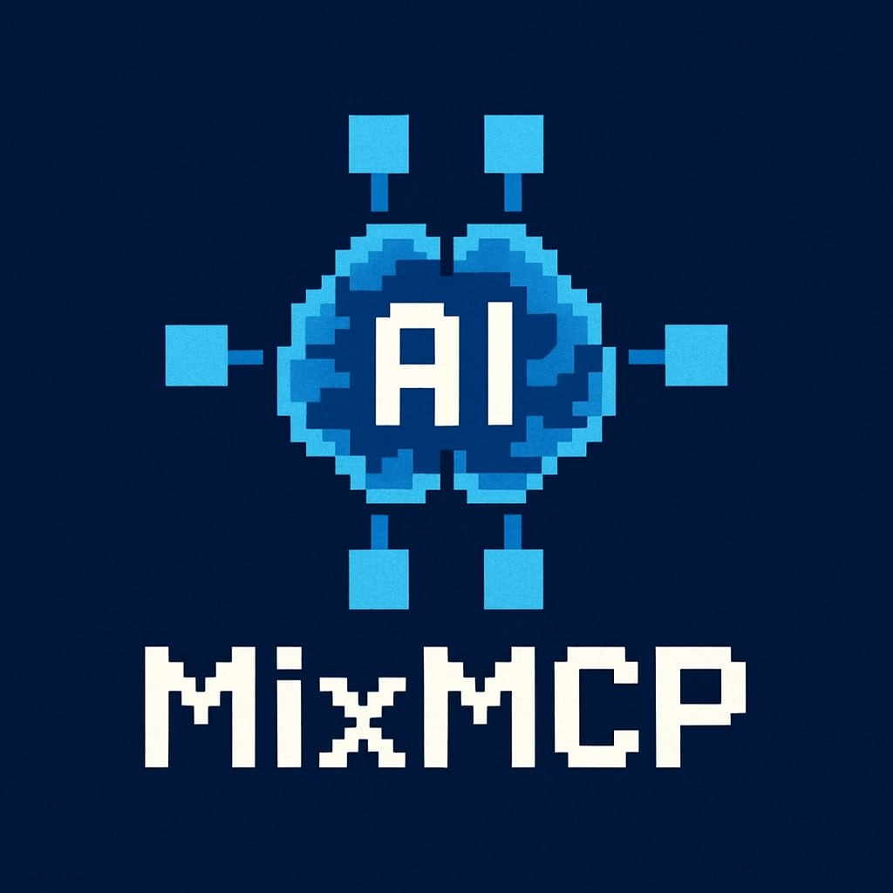

<div align="center">

</div>
<br/>
<div align="center">
</div>


# Mix-MCP

<div align="center" style="font-size: 1.5em;">
  <p><strong><a href="README.md">English</a>, <a href="README_CN.md">中文</a></strong></p>

  <p><strong><a href="">GitBook</a></strong></p>

</div>

🌐 Mix-MCP 是一个创新平台，通过利用 Anthropic 于 🗓️ 2024 年 12 月推出的 Model Context Protocol (MCP)，在 Web3 世界与大型语言模型 (LLMs) 之间架起桥梁。我们的项目旨在提供一个开放平台，让任何 Web3 技术、应用或工具都能与大型语言模型交互。🤖 任何 AI+Web3 项目都可以使用我们的工具轻松对接大模型！

🔍 以 ETH 交易场景为例，您可以与 AI 助手对话，让它获取实时 📊 K 线数据和专家分析，解析市场指标，生成市场评估报告，预测 ETH 走势，构建交易策略，将实时市场评估整合到策略中，并智能发起或终止交易 📈📉。这一用户场景包含三大核心组件：

## Highlights
- 🔄 MCP 聚合：整合当前用于区块链的 MCP 服务（如链上数据检索），并封装成统一接口。此功能可简化开发者和交易者的数据访问流程，解决多链生态割裂问题。
- 📈 市场信息分析：基于 MCP 服务进行市场分析，重点关注与交易相关的市场趋势，为交易决策提供可执行洞见。借助 AI 处理实时数据，在波动市场中可能带来竞争优势。
- 🚀 交易策略执行：内置交易策略，利用最新 MCP 数据和 AI 分析，一键推荐、优化并部署策略。面向新手与专业交易者，降低技术门槛并提升自动化程度。

## Advantages
- MCP 聚合的实用性：为多链数据访问提供统一接口，显著降低开发者与交易者的使用门槛。对于 DeFi、NFT 等需要快速获取链上数据的场景尤为关键；多链兼容性也是当前碎片化区块链环境中的一大亮点。
- 市场分析的商业价值：基于 MCP 数据的 AI 驱动分析（尤其是交易趋势）能够提供实时且精准的市场洞见。在加密市场高波动背景下，及时决策至关重要。结合链上数据（如交易量、持仓分布）与链下数据（如社交媒体情绪、宏观经济指标），可提升分析深度，吸引专业交易员与机构。
- 交易策略自动化：内置并经 AI 优化的策略覆盖从新手到专家的广泛用户。一键部署降低了技术壁垒，适合追求快速落地的用户。若能依据市场波动或用户风险偏好进行动态调整，则可进一步改善体验和收益。
- 顺应趋势：将 Web3 的去中心化与透明性，与 AI 的预测能力相结合，契合 “区块链 + AI” 的增长趋势，可吸引关注前沿技术的投资者与用户。这一协同在算法交易、DeFi 收益优化、链上资产管理等领域具有广泛应用前景。

## Getting Started

### 1.Clone The Project
```shell
git clone https://github.com/FuradWho/Mix-MCP
cd Mix-MCP
```
### 2.Install Dependencies
```shell
go get .
```
### 3.Set Up MCP Servers
MixMCP 使用多个兼容 MCP 的后端服务。可在 config.json 中进行配置。
```json
{
  "mcp-servers": [
    {
      "type": "stdio",
      "command": "node",
      "args": [
        "/path/to/index.js"
      ],
      "env": [
        "ALCHEMY_API_KEY=your-alchemy-key"
      ]
    },
    {
      "type": "stdio",
      "command": "node",
      "args": [
        "path/to/index.js"
      ],
      "env": []
    }
  ]
}
```
### 4.Configure Exchange Access
> ⚠️ 重要：请妥善保管 API Key，切勿提交到版本控制。
```json
{
  "exchanges": {
    "bitget": {
      "url": "https://api.bitget.com",
      "apiKey": "your-api-key",
      "secretKey": "your-secret-key",
      "password": "your-api-password"
    },
    "binance": {
      "url": "https://api.binance.com",
      "apiKey": "your-api-key",
      "secretKey": "your-secret-key",
      "password": ""
    }
  }
}
```
### 5.Build
```shell
cd Mix-MCP
go build . 
```
### 6.Use In MCP Client
```json
{
  "mcpServers": {
    "fetch": {
      "command": "path/to/executable",
      "args": [
        "--config",
        "path/to/config.json"
      ]
    }
  }
}
```

## Roadmap
### Phase 1 - Version Alpha
- 集成 50+ MCP
- 基于 MCP 聚合器的市场分析
- 集成 Bitget 交易 API
- 内置 3+ 交易策略
- 自动执行交易策略
### Phase 2 - Trial & Feedback Collection
- 消除恶意错误
- 分析用户体验
- 评估交易策略表现
### Phase 3 - Version Beta
- 集成 100+ MCP
- 集成 Solana、EVMs、Sui DEX 交易
- 集成 20+ CEX 交易 API
- 内置 10+ 交易策略
- 提供自定义 MCP 与策略模板
- 支持历史数据回测
- 提供可视化市场分析与交易管理工具

## Terms of Use &  Privacy Policy
https://ethbeijing.gitbook.io/mixmcp/terms-of-use-and-privacy-policy
